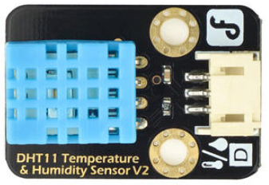

# DFRobot_DHT11

* [中文](./README_CN.md)

DHT11 is used to read the temperature and humidity of the current environment. 



## Product Link（[https://www.dfrobot.com/product-174.html](https://www.dfrobot.com/product-174.html)）
    SKU: DFR0067

* [Summary](#summary)
* [Installation](#installation)
* [Methods](#methods)
* [Compatibility](#compatibility)
* [History](#history)
* [Credits](#credits)

## Summary
Provides an Arduino library for read DHT11 data to calculate temperature and humidity.

## Installation

To use this library download the zip file, uncompress it to a folder named DFRobot_DHT11. 
Download the zip file first to use this library and uncompress it to a folder named DFRobot_DHT11. 

## Methods

```C++

  /**
   * @fn read
   * @brief Read DHT11 data
   * @param pin: Connect the IO port of the DHT11 data port.
   * @return NONE    
   */
  void read(int pin); 
```
## Compatibility

MCU                | Work Well | Work Wrong | Untested  | Remarks
------------------ | :----------: | :----------: | :---------: | -----
FireBeetle-ESP32  |             |       √     |            | 
FireBeetle-ESP8266  |      √       |             |            | 
Arduino uno |       √      |             |            | 

## History

- 2018/09/14 - Version 0.1 released.

## Credits

Written by Wuxiao(xiao.wu@dfrobot.com), 2018. (Welcome to our [website](https://www.dfrobot.com/))

