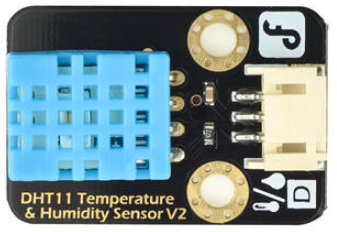

# DFRobot_DHT11

* [English Version](./README.md)

DHT11 用于读取当前环境的温度和湿度。




## 产品链接（[https://www.dfrobot.com.cn/goods-109.html](https://www.dfrobot.com.cn/goods-109.html)）
    SKU: DFR0067
   
## 目录

* [概述](#概述)
* [库安装](#库安装)
* [方法](#方法)
* [兼容性](#兼容性)
* [历史](#历史)
* [创作者](#创作者)

## 概述

提供 Arduino 库，用于读取 DHT11 数据以计算温度和湿度。

## 库安装

使用此库前，请首先下载库文件，将其粘贴到\Arduino\libraries目录中，然后打开examples文件夹并在该文件夹中运行演示。

## 方法

```C++
  /**
   * @fn read
   * @brief 读取 DHT11 温湿度的信息
   * @param pin  连接DHT11数据口的IO口。
   * @return 无    
   */
  void read(int pin);
```

## 兼容性

MCU                | Work Well | Work Wrong | Untested  | Remarks
------------------ | :----------: | :----------: | :---------: | -----
FireBeetle-ESP32  |             |       √     |            | 
FireBeetle-ESP8266  |      √       |             |            | 
Arduino uno |       √      |             |            | 

## 历史

- 2018/09/14 - 1.0.0 版本

## 创作者

Written by Wuxiao(xiao.wu@dfrobot.com), 2018. (Welcome to our [website](https://www.dfrobot.com/))


